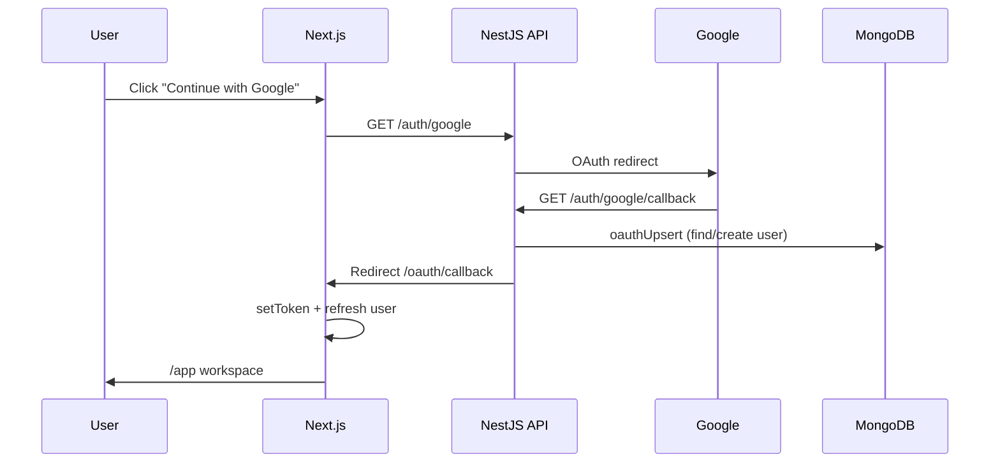

# Auth, Social Login, About Page & Large UI Plan

## Context

**No Supabase migration.** Auth stays on the existing stack:

- **API:** NestJS + MongoDB (`User` schema with `googleId` / `linkedinId` fields)
- **Web:** `AuthProvider` in [`apps/web/src/lib/auth.tsx`](apps/web/src/lib/auth.tsx), JWT in sessionStorage via [`apps/web/src/lib/api.ts`](apps/web/src/lib/api.ts)

**Social auth already exists on the backend** — it just needs env credentials and a proper frontend:

```102:117:apps/api/src/modules/auth/auth.controller.ts
  @Public()
  @Get("google")
  @UseGuards(AuthGuard("google"))
  google() { return; }

  @Public()
  @Get("google/callback")
  @UseGuards(AuthGuard("google"))
  async googleCb(@Req() req: Request, @Res() res: Response) {
    const tokens = await this.auth.oauthUpsert("google", req.user as { id: string; email: string; name?: string });
    // ... sets refresh cookie, redirects to /oauth/callback#access=...
  }
```

Login page today only shows plain text links to Google/LinkedIn — no branded buttons, and register has no social options at all.



---

## 1. Enable Google (and LinkedIn) social auth cleanly

### Backend (small, targeted changes)

| Change | File | Why |
|--------|------|-----|
| Conditional OAuth providers | [`apps/api/src/modules/auth/auth.module.ts`](apps/api/src/modules/auth/auth.module.ts) | Only register `GoogleStrategy` / `LinkedInStrategy` when `GOOGLE_CLIENT_ID` / `LINKEDIN_CLIENT_ID` are set — avoids boot failures with `"disabled"` placeholders |
| Public providers endpoint | [`apps/api/src/modules/auth/auth.controller.ts`](apps/api/src/modules/auth/auth.controller.ts) | `GET /auth/providers` → `{ google: boolean, linkedin: boolean }` so the UI hides buttons when not configured |
| Env docs | [`.env.example`](.env.example) | Add short comments for Google Cloud Console + LinkedIn app setup (redirect URIs, required scopes) |

**Google Cloud setup (manual, documented in plan):**
- Create OAuth 2.0 Web client
- Authorized redirect URI: `http://localhost:4000/auth/google/callback` (and production equivalent)
- Set `GOOGLE_CLIENT_ID`, `GOOGLE_CLIENT_SECRET`, `GOOGLE_CALLBACK_URL` in `.env`

**No MongoDB schema changes needed** — `oauthUpsert` in [`auth.service.ts`](apps/api/src/modules/auth/auth.service.ts) already creates/links users by provider ID or email.

### Frontend social auth UX

| Change | File |
|--------|------|
| `SocialAuthButtons` component | New: `apps/web/src/components/auth/SocialAuthButtons.tsx` |
| Branded Google + LinkedIn buttons (large, full-width) | Inline SVG icons, redirect to `${NEXT_PUBLIC_API_URL}/auth/google` |
| Fetch enabled providers | Call `/auth/providers` on mount; render only available buttons |
| Add social buttons to login **and** register | [`login/page.tsx`](apps/web/src/app/login/page.tsx), [`register/page.tsx`](apps/web/src/app/register/page.tsx) |
| Fix OAuth callback | [`oauth/callback/page.tsx`](apps/web/src/app/oauth/callback/page.tsx) — use `useAuth().setAccess()` + `refresh()` instead of only `setToken`, handle missing token gracefully |

---

## 2. Redesign auth pages (smart, on-brand)

Create a shared layout so login/register/forgot/reset all match the landing page aesthetic.

**New files:**
- `apps/web/src/components/auth/AuthShell.tsx` — split layout: left panel (Logo, headline, trust bullets from `landingCopy`), right panel (form card with glass/card styling from [`landing.module.css`](apps/web/src/components/landing/landing.module.css))
- `apps/web/src/components/auth/auth.module.css` — auth-specific styles (reuse tokens: `--accent`, Fraunces headings, framer-motion fade-in)

**Copy:** Add an `auth` section to [`landingCopy.ts`](apps/web/src/components/landing/landingCopy.ts) (login headline, register headline, social divider text `"or continue with email"`).

**Pages to refactor** (logic unchanged, layout swapped):
- [`login/page.tsx`](apps/web/src/app/login/page.tsx)
- [`register/page.tsx`](apps/web/src/app/register/page.tsx)
- [`forgot/page.tsx`](apps/web/src/app/forgot/page.tsx)
- [`reset/page.tsx`](apps/web/src/app/reset/page.tsx)

---

## 3. Large input / button / font design system

Update global patterns in [`apps/web/src/app/globals.css`](apps/web/src/app/globals.css) so large controls are consistent app-wide without breaking the app workspace.

**Proposed tokens (additive, not breaking existing `.btn`):**

```css
:root {
  --control-height-lg: 52px;
  --control-font-lg: 17px;
  --control-padding-x-lg: 20px;
}
.btn.lg { padding: 14px 24px; font-size: var(--control-font-lg); min-height: var(--control-height-lg); }
.field.lg input { padding: 16px 18px; font-size: var(--control-font-lg); min-height: var(--control-height-lg); }
.field.lg label { font-size: 15px; }
```

**Apply `.lg` to:**
- All auth form inputs and submit buttons
- About/Contact form + newsletter
- Hero primary/secondary CTAs in [`HeroSection.tsx`](apps/web/src/components/landing/HeroSection.tsx)
- Final CTA button in [`FinalCtaSection.tsx`](apps/web/src/components/landing/FinalCtaSection.tsx)
- Header `"Start free"` button in [`SiteHeader.tsx`](apps/web/src/components/layout/SiteHeader.tsx)

Keep default `.btn` / `.field` sizes in `/app/*` workspace unless a page already benefits from larger controls — scope the upgrade to marketing + auth surfaces.

---

## 4. About Us page (replaces API in header)

### Navigation changes

| Location | Change |
|----------|--------|
| [`SiteHeader.tsx`](apps/web/src/components/layout/SiteHeader.tsx) | Replace `API` link → `About` (`/about`) |
| [`SiteFooter.tsx`](apps/web/src/components/layout/SiteFooter.tsx) | Add `About` under Resources; keep API docs link in footer only (developers still need it) |
| [`PricingSection.tsx`](apps/web/src/components/landing/PricingSection.tsx) | Wire Studio `"Contact us"` button → `/about#contact` |

### New route: `/about`

**File:** `apps/web/src/app/about/page.tsx`

**Sections (single scroll page, landing design patterns):**

1. **Hero strip** — eyebrow, title `"About VitaCircle"`, mission paragraph
2. **Our story** — 2-column grid (text + image from existing `/public/student-researching-bg.jpg`)
3. **Contact** (`#contact`) — phone, email, office address (placeholder content in `landingCopy.about.contact`):
   - Phone: e.g. `+1 (555) 482-0147`
   - Email: `hello@vitacircle.app`
   - Address: e.g. `1200 Creative Way, Suite 400, Austin, TX 78701`
4. **Contact form** — name, email, subject, message (large `.field.lg` inputs); POST to a new public API endpoint or mail stub
5. **Newsletter** — email + `"Subscribe"` button (large); stores intent via API

**Copy:** Add `about` block to [`landingCopy.ts`](apps/web/src/components/landing/landingCopy.ts).

**Styles:** Extend [`landing.module.css`](apps/web/src/components/landing/landing.module.css) with `.aboutHero`, `.contactGrid`, `.contactCard`, `.newsletterBar`.

### Contact / newsletter API (minimal)

Add to NestJS (keeps MongoDB, no new infra):

| Endpoint | Behavior |
|----------|----------|
| `POST /platform/contact` | `@Public()` — validate + log/send via existing `MailService` (console in dev) |
| `POST /platform/newsletter` | `@Public()` — upsert email in new `NewsletterSubscriber` Mongo collection (email + `createdAt`) |

New schema: `apps/api/src/schemas/newsletter.schema.ts` — simple `{ email, createdAt }`.

---

## 5. Hero section UI modifications

Targeted updates in [`HeroSection.tsx`](apps/web/src/components/landing/HeroSection.tsx) + [`landing.module.css`](apps/web/src/components/landing/landing.module.css):

- Apply `btn lg` to primary/secondary CTAs
- Bump subhead to `clamp(18px, 2vw, 20px)` for readability
- Increase trust row to `15–16px`
- Slightly increase `.heroActions` gap and top margin for breathing room with larger buttons
- Optional: add a compact inline newsletter teaser below trust row (`"Get portfolio tips —"` + email input + subscribe) using same large control pattern — links to `/about#newsletter` or inline submit

These changes stay visual-only; no change to hero content strategy from [`landingCopy.ts`](apps/web/src/components/landing/landingCopy.ts) unless copy tweaks are needed for the newsletter line.

---

## 6. File summary

| Action | Path |
|--------|------|
| Modify | `globals.css`, `SiteHeader.tsx`, `SiteFooter.tsx`, `HeroSection.tsx`, `FinalCtaSection.tsx`, `PricingSection.tsx`, `landingCopy.ts`, `landing.module.css` |
| Modify | `login/register/forgot/reset/page.tsx`, `oauth/callback/page.tsx` |
| Modify | `auth.module.ts`, `auth.controller.ts`, `.env.example` |
| Create | `SocialAuthButtons.tsx`, `AuthShell.tsx`, `auth.module.css`, `about/page.tsx`, `newsletter.schema.ts`, contact/newsletter endpoints in platform module |

---

## 7. Testing checklist

- Email/password login and register still work
- Google OAuth: redirect → callback → lands in `/app` with user loaded
- OAuth buttons hidden when `GOOGLE_CLIENT_ID` is empty
- About page renders contact info, form submits, newsletter saves
- Header shows About (not API); footer still links API docs
- Hero and auth buttons/inputs meet large touch-target sizing (~52px height)
- Mobile: auth split layout stacks; about contact grid becomes single column

---

## Out of scope (follow-ups)

- Supabase migration (explicitly declined)
- Additional providers (Apple, GitHub) — same Passport pattern can be added later
- Full email delivery in production (SMTP config already exists in `.env.example`)
- Next.js middleware for server-side route protection (existing `AppShell` client guard remains)
