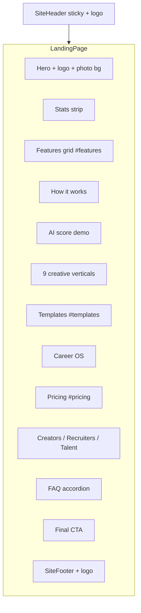

# Landing Page Redesign (Updated)

## Goal

Ship a **complete, smooth-animated landing page** that covers everything VitaCircle does. Copy and exact values are **placeholders** — easy to edit later in component files. Visual polish and motion come first.

## Existing assets ([`apps/web/public/`](apps/web/public/))

| Asset | Use |
|-------|-----|
| [`logo.png`](apps/web/public/logo.png) | Header, footer, favicon, final CTA — blue/teal network mark + "Vitacircle" wordmark |
| [`student-with-books-bg.jpg`](apps/web/public/student-with-books-bg.jpg) | **Primary hero background** — student/creative audience, strong right-side negative space for headline |
| [`student-with-bag-bg.jpg`](apps/web/public/student-with-bag-bg.jpg) | Alternate hero or audience CTA panel |
| [`student-researching-bg.jpg`](apps/web/public/student-researching-bg.jpg) | Career OS / education section background |
| [`computer-bg1.jpg`](apps/web/public/computer-bg1.jpg) | How-it-works or builder section — workspace/productivity vibe |
| [`4291.jpg`](apps/web/public/4291.jpg) | Fallback section texture (evaluate at build time; swap if low quality) |

**Background treatment:** All photos get a layered overlay (`linear-gradient` + optional `backdrop-filter` on content cards) so text stays readable. Hero uses `next/image` with `fill`, `object-position: center right`, and a left-heavy gradient scrim.

**If an asset clashes:** Only download replacements for sections that look off (e.g. abstract grain/noise PNG for subtle texture). Prefer existing photos first — they match the student/creative audience.

## Brand alignment

Current [`globals.css`](apps/web/src/app/globals.css) uses warm orange accent (`#C45C26`). The **logo is blue/teal**. Plan: **shift tokens to match the logo** while keeping editorial typography (Fraunces + Source Sans 3):

- `--accent: #2B6CB0` (logo blue)
- `--accent-secondary: #3AAFA9` (logo teal dots)
- `--accent-soft: rgba(43, 108, 176, 0.08)`
- Keep `--bg: #FAF8F5`, `--ink: #1A1916` for readability
- Orange retired from primary CTAs; optional as warm highlight only

Logo displayed via `next/image` at ~140px width in header, ~120px in footer.

## Page structure



## Implementation

### 1. Dependency

Add `framer-motion` to [`apps/web/package.json`](apps/web/package.json).

### 2. Component library — `apps/web/src/components/landing/`

| File | Content (placeholder copy OK) |
|------|-------------------------------|
| `LandingPage.tsx` | Composes all sections |
| `HeroSection.tsx` | Full-viewport hero, `student-with-books-bg.jpg`, logo badge, headline, 2 CTAs, CSS portfolio mockup float |
| `StatsStrip.tsx` | 4 animated counters (verticals, templates, blocks, AI scores) |
| `FeaturesGrid.tsx` | 8 feature cards with icons |
| `HowItWorks.tsx` | 3 steps with `computer-bg1.jpg` side panel |
| `AiScoreDemo.tsx` | Animated ring 0→87 + rubric bars from `AI_RUBRIC_WEIGHTS` |
| `VerticalsSection.tsx` | Grid from `VERTICAL_LABELS` |
| `TemplatesShowcase.tsx` | Scroll/grid from `TEMPLATES` + accent swatches |
| `CareerOsSection.tsx` | Pipeline visual + `student-researching-bg.jpg` |
| `PricingSection.tsx` | Free / Pro / Studio from `PLAN_ENTITLEMENTS` — prices as placeholders ($12 Pro, Contact Studio) |
| `AudienceCTA.tsx` | 3 cards → `/register`, `/recruiter`, `/talent` |
| `FaqSection.tsx` | 6 accordion items, generic FAQ copy |
| `FinalCtaSection.tsx` | Accent gradient + logo + "Start free" |
| `motion.ts` | Shared `fadeUp`, `stagger`, `float`, `countUp` helpers |
| `landing.module.css` | Hero overlay, section spacing, card grids, photo backgrounds |

Copy lives in a single `landingCopy.ts` file so **all wordings can be edited in one place later**.

### 3. Layout components

**[`SiteHeader.tsx`](apps/web/src/components/layout/SiteHeader.tsx)**
- Sticky + blur on scroll
- `<Image src="/logo.png" />` instead of text wordmark
- Anchor links: Features, Templates, Pricing
- Existing auth CTAs unchanged

**New `SiteFooter.tsx`**
- Logo, tagline from logo ("Connecting Ambition with Opportunity"), links to legal + API docs

### 4. Styles

[`globals.css`](apps/web/src/app/globals.css): updated accent tokens, `.section`, `.eyebrow`, `.section-title`, `prefers-reduced-motion` fallbacks.

[`landing.module.css`](apps/web/src/components/landing/landing.module.css): hero photo layer, content scrims, responsive grids.

### 5. Thin page entry

[`page.tsx`](apps/web/src/app/page.tsx):

```tsx
import { SiteHeader } from "@/components/layout/SiteHeader";
import { LandingPage } from "@/components/landing/LandingPage";

export default function HomePage() {
  return (
    <>
      <SiteHeader />
      <LandingPage />
    </>
  );
}
```

### 6. Animation spec (smooth, not flashy)

| Element | Motion |
|---------|--------|
| Page load | Hero content stagger fade-up (0.5s, ease `[0.22, 1, 0.36, 1]`) |
| Hero mockup | Gentle float loop (`y: [0, -10, 0]`, 4s infinite) |
| Scroll sections | `whileInView` fade-up + slight translate, `once: true`, `margin: "-80px"` |
| Grids | Stagger children 0.08s apart |
| Stats / AI score | Count-up on enter view |
| Cards | Hover `y: -4`, shadow deepen |
| FAQ | Height accordion with `AnimatePresence` |
| Header | Backdrop blur fades in after 60px scroll |

All motion disabled when `prefers-reduced-motion: reduce`.

### 7. Shared data (structure accurate, values editable)

Import from `@vitacircle/shared` for grids that should stay in sync: `TEMPLATES`, `VERTICAL_LABELS`, `AI_RUBRIC_WEIGHTS`, `PLAN_ENTITLEMENTS`. Marketing headlines/prices in `landingCopy.ts` — not tied to backend.

### 8. Metadata

[`layout.tsx`](apps/web/src/app/layout.tsx): title, description, favicon → `/logo.png`.

## Files changed

- [`apps/web/package.json`](apps/web/package.json)
- [`apps/web/src/app/page.tsx`](apps/web/src/app/page.tsx)
- [`apps/web/src/app/globals.css`](apps/web/src/app/globals.css)
- [`apps/web/src/app/layout.tsx`](apps/web/src/app/layout.tsx)
- [`apps/web/src/components/layout/SiteHeader.tsx`](apps/web/src/components/layout/SiteHeader.tsx)
- **New:** `apps/web/src/components/layout/SiteFooter.tsx`
- **New:** `apps/web/src/components/landing/*` (~14 files)
- **Uses existing:** `apps/web/public/logo.png` + 5 background JPGs

## Out of scope

- Perfect final marketing copy (placeholders throughout)
- Tailwind / shadcn
- Changes to `/app/*` builder or API
- Custom logo redesign

## Verification

1. `npm run build -w @vitacircle/web`
2. http://localhost:3000 — hero photo + logo visible, all sections scroll smoothly
3. Mobile: single column, hero text readable over overlay
4. Edit test: change one string in `landingCopy.ts` → confirms easy copy updates
